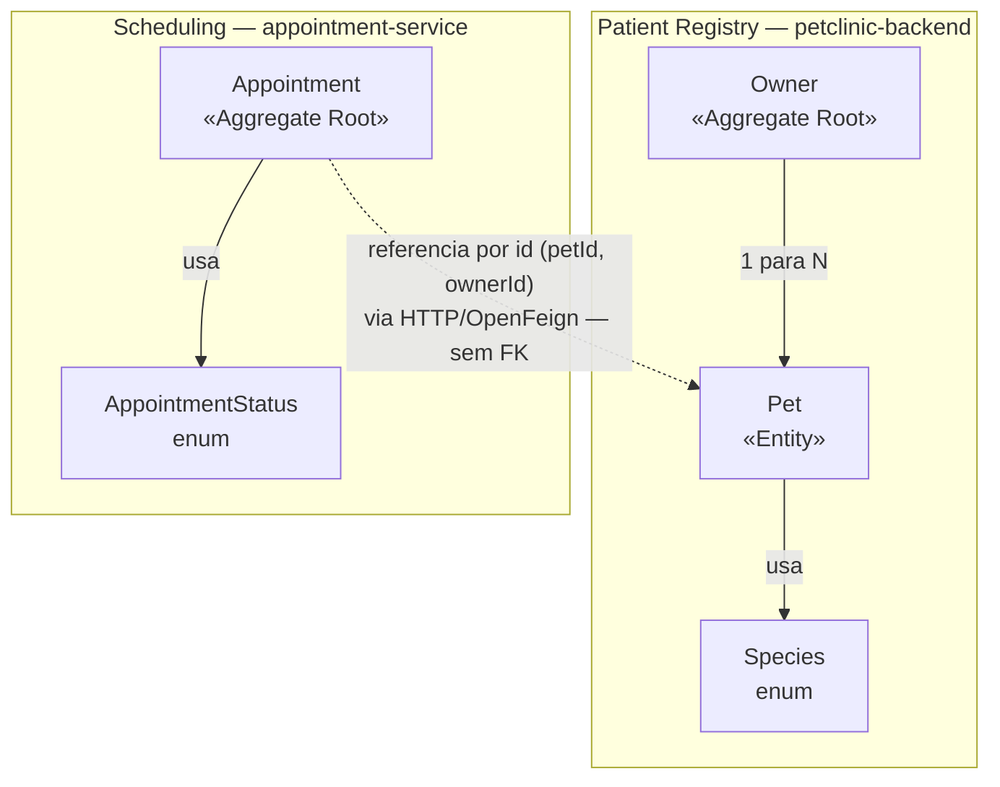
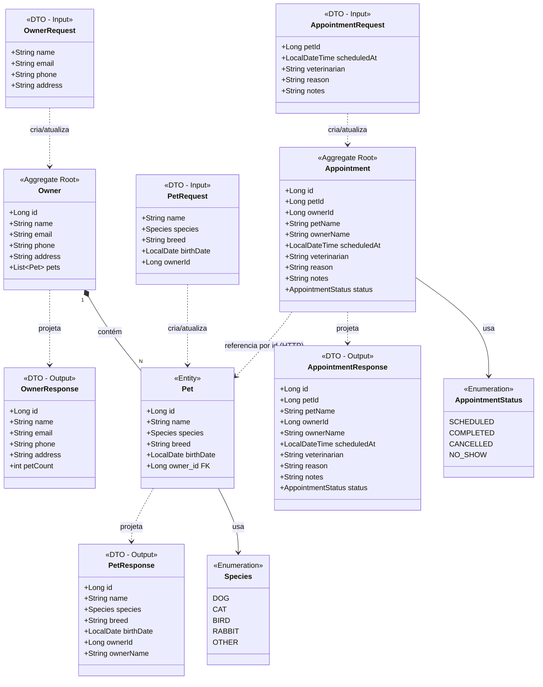
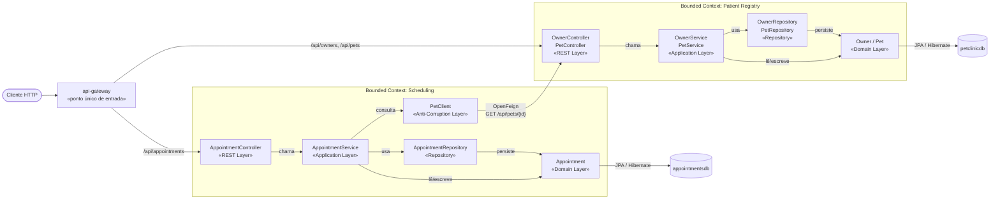

# Context Map

O sistema tem **dois contextos delimitados**, implantados como serviços separados e
com bancos de dados independentes. A relação é **Customer/Supplier**: `Scheduling`
consome dados de `Patient Registry`, que não conhece o consumidor.

O limite entre os contextos é uma chamada HTTP, não um JOIN: `Appointment` guarda
apenas identificadores de `Pet`/`Owner` e um snapshot dos nomes. Detalhes da
integração em [microservice-architecture.md](microservice-architecture.md).

---

# Modelo de Agregados

Note que `AppointmentRequest` **não** tem `ownerId`: o tutor e os nomes são
resolvidos pelo microsserviço consultando o `petclinic-backend`.

---

# Camadas da Arquitetura

Ambos os serviços seguem o mesmo empilhamento de camadas. O que muda no
`appointment-service` é a origem dos dados externos: um cliente HTTP no lugar
de um repositório.

`PetClient` faz o papel de camada anticorrupção: traduz o `PetResponse` do outro
contexto para o `PetSummary` que o Scheduling entende, e converte as falhas remotas
em exceções do próprio domínio (404 para pet inexistente, 503 para serviço fora do ar).

O acesso ao banco é feito via JPA/Hibernate e o datasource concreto é
escolhido por profile do Spring, sem alterar o código de domínio:

- **Perfil padrão** — H2 in-memory (`ddl-auto=create-drop`), usado em dev/testes.
- **Perfil `postgres`** — PostgreSQL persistente (`ddl-auto=update`,
  `PostgreSQLDialect`), ativado com `SPRING_PROFILES_ACTIVE=postgres`.

---