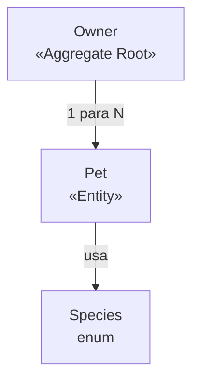
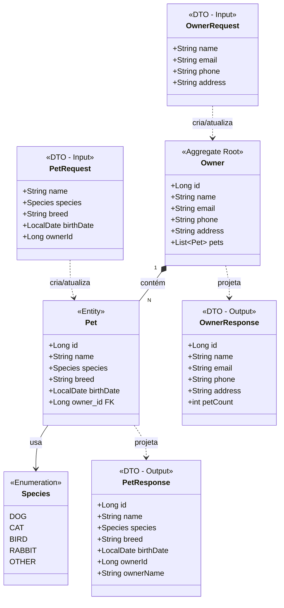
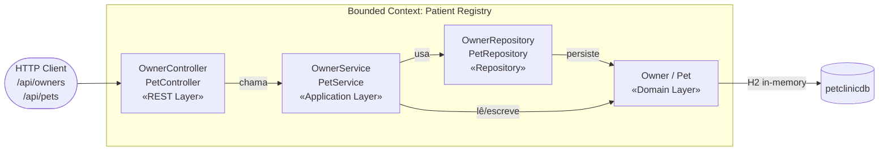

# Context Map

```mermaid
flowchart TD
  direction TB
  PR_AR["Owner\n«Aggregate Root»"]
  PR_E["Pet\n«Entity»"]
  PR_VO["Species\nenum"]

  PR_AR -- "1 para N" --> PR_E
  PR_E -- usa --> PR_VO
```

---

# Modelo de Agregados

```mermaid
classDiagram
    class Owner {
        <<Aggregate Root>>
        +Long id
        +String name
        +String email
        +String phone
        +String address
        +List~Pet~ pets
    }

    class Pet {
        <<Entity>>
        +Long id
        +String name
        +Species species
        +String breed
        +LocalDate birthDate
        +Long owner_id FK
    }

    class Species {
        <<Enumeration>>
        DOG
        CAT
        BIRD
        RABBIT
        OTHER
    }

    class OwnerRequest {
        <<DTO - Input>>
        +String name
        +String email
        +String phone
        +String address
    }

    class OwnerResponse {
        <<DTO - Output>>
        +Long id
        +String name
        +String email
        +String phone
        +String address
        +int petCount
    }

    class PetRequest {
        <<DTO - Input>>
        +String name
        +Species species
        +String breed
        +LocalDate birthDate
        +Long ownerId
    }

    class PetResponse {
        <<DTO - Output>>
        +Long id
        +String name
        +Species species
        +String breed
        +LocalDate birthDate
        +Long ownerId
        +String ownerName
    }

    Owner "1" *-- "N" Pet : contém
    Pet --> Species : usa

    OwnerRequest ..> Owner : cria/atualiza
    Owner ..> OwnerResponse : projeta

    PetRequest ..> Pet : cria/atualiza
    Pet ..> PetResponse : projeta
```

---

# Camadas da Arquitetura

```mermaid
flowchart LR
    subgraph BC["Bounded Context: Patient Registry"]
        direction TB
        C["OwnerController\nPetController\n«REST Layer»"]
        S["OwnerService\nPetService\n«Application Layer»"]
        R["OwnerRepository\nPetRepository\n«Repository»"]
        E["Owner / Pet\n«Domain Layer»"]

        C -->|chama| S
        S -->|usa| R
        R -->|persiste| E
        S -->|lê/escreve| E
    end

    HTTP(["HTTP Client\n/api/owners\n/api/pets"]) --> C
    E -->|H2 in-memory| DB[("petclinicdb")]
```
