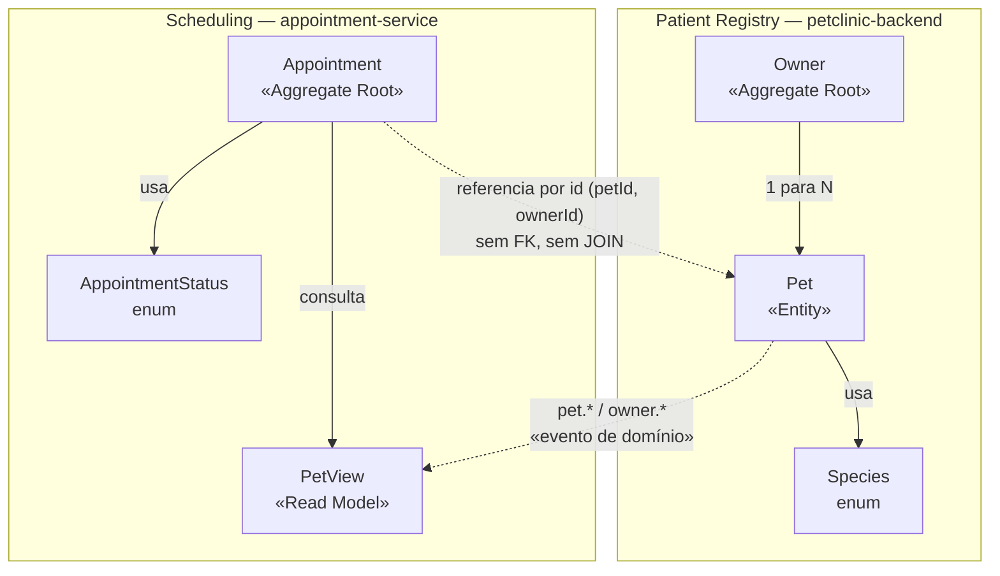
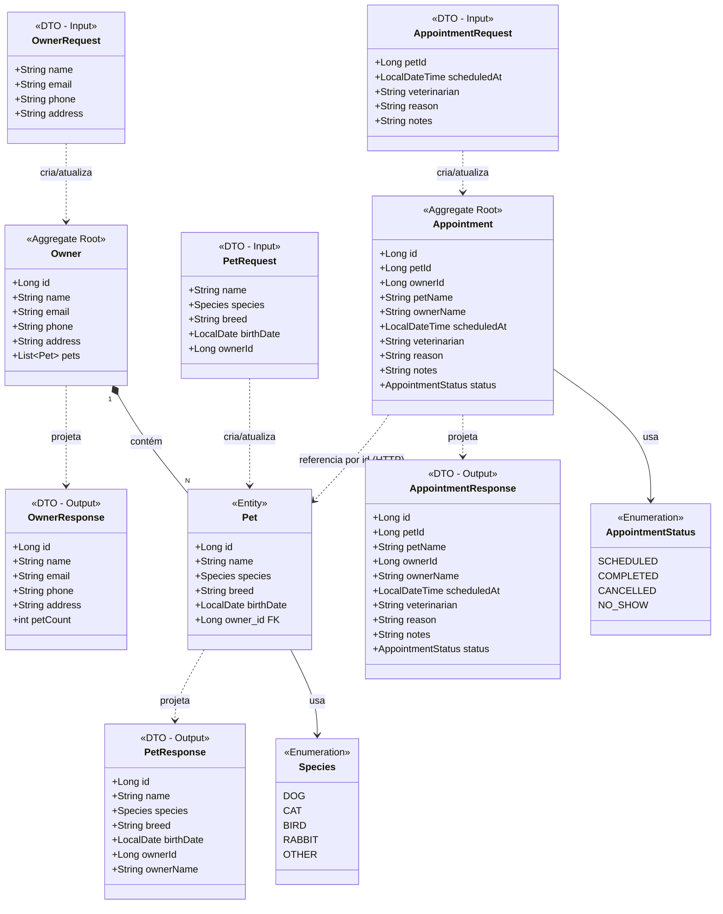
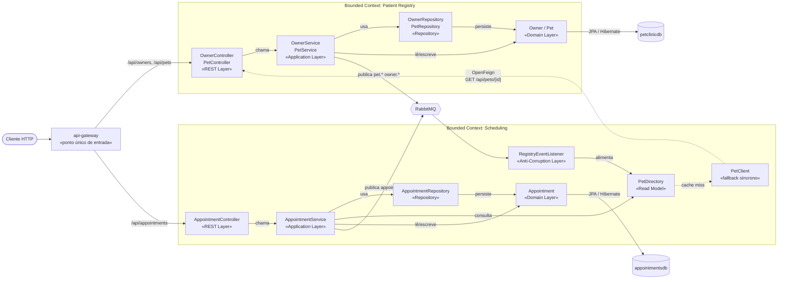

# Context Map

O sistema tem **três contextos delimitados**, implantados como serviços separados e
com bancos de dados independentes.

A integração entre eles é **Publisher/Subscriber**: cada contexto publica os fatos do
seu domínio num exchange e não conhece quem os consome. É uma evolução do
Customer/Supplier original — antes, `Scheduling` chamava `Patient Registry` por HTTP e
a relação era explícita nos dois sentidos de dependência de disponibilidade. Hoje o
publicador não sabe quem escuta: `Patient Registry` publica num exchange e nunca soube
que `Scheduling` existe, e um assinante novo entra declarando fila e binding, sem que
nenhuma linha do produtor mude.

```mermaid
flowchart TD
  subgraph PR["Patient Registry — petclinic-backend"]
    direction TB
    PR_AR["Owner\n«Aggregate Root»"]
    PR_E["Pet\n«Entity»"]
    PR_VO["Species\nenum"]

    PR_AR -- "1 para N" --> PR_E
    PR_E -- usa --> PR_VO
  end

  subgraph SC["Scheduling — appointment-service"]
    direction TB
    SC_AR["Appointment\n«Aggregate Root»"]
    SC_VO["AppointmentStatus\nenum"]
    SC_PV["PetView\n«Read Model»"]

    SC_AR -- usa --> SC_VO
    SC_AR -- consulta --> SC_PV
  end

  PR_E -. "pet.* / owner.*\n«evento de domínio»" .-> SC_PV
  SC_AR -. "referencia por id (petId, ownerId)\nsem FK, sem JOIN" .-> PR_E
```

O limite entre os contextos é um **evento**, não um JOIN nem uma chamada HTTP.
`Appointment` guarda apenas identificadores de `Pet`/`Owner` e um snapshot dos nomes;
`PetView` é um modelo de leitura mantido pelos eventos do contexto vizinho — uma
tradução para a linguagem do Scheduling, não uma cópia do modelo alheio.

Detalhes da integração em [microservice-architecture.md](microservice-architecture.md)
e do fluxo de eventos em [event-driven-architecture.md](event-driven-architecture.md).

---

# Modelo de Agregados

```mermaid
classDiagram
    class Owner {
        <<Aggregate Root>>
        +Long id
        +String name
        +String email
        +String phone
        +String address
        +List~Pet~ pets
    }

    class Pet {
        <<Entity>>
        +Long id
        +String name
        +Species species
        +String breed
        +LocalDate birthDate
        +Long owner_id FK
    }

    class Species {
        <<Enumeration>>
        DOG
        CAT
        BIRD
        RABBIT
        OTHER
    }

    class OwnerRequest {
        <<DTO - Input>>
        +String name
        +String email
        +String phone
        +String address
    }

    class OwnerResponse {
        <<DTO - Output>>
        +Long id
        +String name
        +String email
        +String phone
        +String address
        +int petCount
    }

    class PetRequest {
        <<DTO - Input>>
        +String name
        +Species species
        +String breed
        +LocalDate birthDate
        +Long ownerId
    }

    class PetResponse {
        <<DTO - Output>>
        +Long id
        +String name
        +Species species
        +String breed
        +LocalDate birthDate
        +Long ownerId
        +String ownerName
    }

    class Appointment {
        <<Aggregate Root>>
        +Long id
        +Long petId
        +Long ownerId
        +String petName
        +String ownerName
        +LocalDateTime scheduledAt
        +String veterinarian
        +String reason
        +String notes
        +AppointmentStatus status
    }

    class AppointmentStatus {
        <<Enumeration>>
        SCHEDULED
        COMPLETED
        CANCELLED
        NO_SHOW
    }

    class AppointmentRequest {
        <<DTO - Input>>
        +Long petId
        +LocalDateTime scheduledAt
        +String veterinarian
        +String reason
        +String notes
    }

    class AppointmentResponse {
        <<DTO - Output>>
        +Long id
        +Long petId
        +String petName
        +Long ownerId
        +String ownerName
        +LocalDateTime scheduledAt
        +String veterinarian
        +String reason
        +String notes
        +AppointmentStatus status
    }

    Owner "1" *-- "N" Pet : contém
    Pet --> Species : usa

    OwnerRequest ..> Owner : cria/atualiza
    Owner ..> OwnerResponse : projeta

    PetRequest ..> Pet : cria/atualiza
    Pet ..> PetResponse : projeta

    Appointment --> AppointmentStatus : usa
    AppointmentRequest ..> Appointment : cria/atualiza
    Appointment ..> AppointmentResponse : projeta
    Appointment ..> Pet : referencia por id (HTTP)
```

Note que `AppointmentRequest` **não** tem `ownerId`: o tutor e os nomes são
resolvidos pelo microsserviço na sua projeção local `PetView`, alimentada pelos
eventos `pet.*` e `owner.*` do Patient Registry.

---

# Camadas da Arquitetura

Os serviços seguem o mesmo empilhamento de camadas. O que muda no
`appointment-service` é a origem dos dados externos: um modelo de leitura local,
mantido por eventos, no lugar de uma consulta ao outro contexto.

```mermaid
flowchart LR
    HTTP(["Cliente HTTP"]) --> GW["api-gateway\n«ponto único de entrada»"]

    subgraph BC1["Bounded Context: Patient Registry"]
        direction TB
        C["OwnerController\nPetController\n«REST Layer»"]
        S["OwnerService\nPetService\n«Application Layer»"]
        R["OwnerRepository\nPetRepository\n«Repository»"]
        E["Owner / Pet\n«Domain Layer»"]

        C -->|chama| S
        S -->|usa| R
        R -->|persiste| E
        S -->|lê/escreve| E
    end

    subgraph BC2["Bounded Context: Scheduling"]
        direction TB
        C2["AppointmentController\n«REST Layer»"]
        S2["AppointmentService\n«Application Layer»"]
        R2["AppointmentRepository\n«Repository»"]
        E2["Appointment\n«Domain Layer»"]
        P2["PetDirectory\n«Read Model»"]
        L2["RegistryEventListener\n«Anti-Corruption Layer»"]
        F2["PetClient\n«fallback síncrono»"]

        C2 -->|chama| S2
        S2 -->|usa| R2
        S2 -->|consulta| P2
        P2 -.->|cache miss| F2
        L2 -->|alimenta| P2
        R2 -->|persiste| E2
        S2 -->|lê/escreve| E2
    end

    MQ{{"RabbitMQ"}}

    GW -->|"/api/owners, /api/pets"| C
    GW -->|"/api/appointments"| C2
    S -->|"publica pet.* owner.*"| MQ
    MQ --> L2
    S2 -->|"publica appointment.*"| MQ
    F2 -.->|"OpenFeign\nGET /api/pets/{id}"| C

    E -->|JPA / Hibernate| DB[("petclinicdb")]
    E2 -->|JPA / Hibernate| DB2[("appointmentsdb")]
```

A camada anticorrupção migrou do cliente HTTP para o **listener**: `RegistryEventListener`
traduz o evento do Patient Registry em `PetView`, o vocabulário que o Scheduling entende.
O modelo de um contexto nunca vaza para o outro — o que trafega é o payload do evento,
deliberadamente desacoplado das entidades JPA.

`PetClient` permanece como fallback e mantém sua tradução de falhas remotas em exceções
do próprio domínio (404 para pet inexistente, 503 para serviço fora do ar).

O acesso ao banco é feito via JPA/Hibernate e o datasource concreto é
escolhido por profile do Spring, sem alterar o código de domínio:

- **Perfil padrão** — H2 in-memory (`ddl-auto=create-drop`), usado em dev/testes.
- **Perfil `postgres`** — PostgreSQL persistente (`ddl-auto=update`,
  `PostgreSQLDialect`), ativado com `SPRING_PROFILES_ACTIVE=postgres`.

---