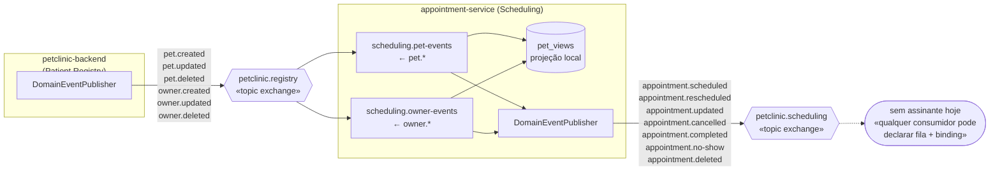

# Arquitetura Orientada a Eventos

## 1. O problema que existia

Na versão anterior, o `appointment-service` obtinha os dados do pet chamando o monolito
por HTTP a cada agendamento, carregando três problemas:

- **Acoplamento de disponibilidade**
- **Latência acumulada**
- **Acoplamento de mudança** 

---

## 2. Prós e contras da arquitetura orientada a eventos

### O que se ganha

- **Desacoplamento temporal**
- **Desacoplamento de conhecimento**
- **Escalabilidade independente**
- **Resiliência**
- **Extensibilidade**

### O que se paga

- **Consistência eventual**
- **Complexidade operacional**
- **Depuração mais difícil**
- **Entrega at-least-once**
- **Contratos implícitos**

---

## 3. Topologia



---

## 4. Contrato de mensagem

Todo evento usa o mesmo envelope, com metadados de entrega separados do payload de domínio:

```json
{
  "eventId": "8f14e45f-ceea-467a-9f9c-2d9e1cba4b1a",
  "eventType": "pet.updated",
  "occurredAt": "2026-09-22T14:31:07.482Z",
  "aggregateType": "pet",
  "aggregateId": "1",
  "version": 1,
  "correlationId": "a3c1e9d2-4b77-4e0a-9f31-6c2e8b5d7a10",
  "payload": {
    "id": 1, "name": "Rex", "species": "DOG", "breed": "Labrador",
    "ownerId": 1, "ownerName": "Alice Souza"
  }
}
```

## 5. Fluxos de eventos

### 5.1 Catálogo

#### Ação → evento publicado

| Ação HTTP | Evento | Exchange |
| --- | --- | --- |
| `POST /api/owners` | `owner.created` | `petclinic.registry` |
| `PUT /api/owners/{id}` | `owner.updated` | `petclinic.registry` |
| `DELETE /api/owners/{id}` | `owner.deleted` | `petclinic.registry` |
| `POST /api/pets` | `pet.created` | `petclinic.registry` |
| `PUT /api/pets/{id}` | `pet.updated` | `petclinic.registry` |
| `DELETE /api/pets/{id}` | `pet.deleted` | `petclinic.registry` |
| `POST /api/appointments` | `appointment.scheduled` | `petclinic.scheduling` |
| `PUT /api/appointments/{id}` — mudou **horário ou veterinário** | `appointment.rescheduled` | `petclinic.scheduling` |
| `PUT /api/appointments/{id}` — mudou **só motivo/observação** | `appointment.updated` | `petclinic.scheduling` |
| `PATCH /api/appointments/{id}/status` → `COMPLETED` | `appointment.completed` | `petclinic.scheduling` |
| `PATCH /api/appointments/{id}/status` → `CANCELLED` | `appointment.cancelled` | `petclinic.scheduling` |
| `PATCH /api/appointments/{id}/status` → `NO_SHOW` | `appointment.no-show` | `petclinic.scheduling` |
| `DELETE /api/appointments/{id}` | `appointment.deleted` | `petclinic.scheduling` |

#### Evento consumido → consequência observável

Só os eventos de cadastro têm consumidor. Para cada um, o que muda no banco e o que sai no
log em nível INFO:

| Evento | Alteração de entidade | Log |
| --- | --- | --- |
| `pet.created` | `INSERT` em `pet_views` | `Recebido pet.created (eventId=…, petId=…)` |
| `pet.updated` | `UPDATE pet_views` **+** `UPDATE appointments` (`pet_name`, `owner_id`, `owner_name`) das consultas `SCHEDULED` | `Recebido pet.updated` **+** `Consulta N sincronizada com o cadastro do pet M` |
| `pet.deleted` | `DELETE` de `pet_views` **+** consultas `SCHEDULED` → `CANCELLED` **+ publica `appointment.cancelled`** | `Recebido pet.deleted` **+** `Consulta N cancelada em cascata (PET_DELETED)` |
| `owner.updated` | `UPDATE pet_views.owner_name` de **todos** os pets do tutor **+** `UPDATE appointments.owner_name` das `SCHEDULED` | apenas `Recebido owner.updated` |
| `owner.deleted` | `DELETE` das `pet_views` listadas em `payload.petIds` **+** consultas do tutor `SCHEDULED` → `CANCELLED` **+ publica `appointment.cancelled`** | `Recebido owner.deleted` **+** `Consulta N cancelada em cascata (OWNER_DELETED)` |
| `owner.created` | **nenhuma** — cai no `default` do `switch` | apenas `Recebido owner.created` |
| `appointment.*` | **nenhuma** — o exchange não tem assinante | nada |