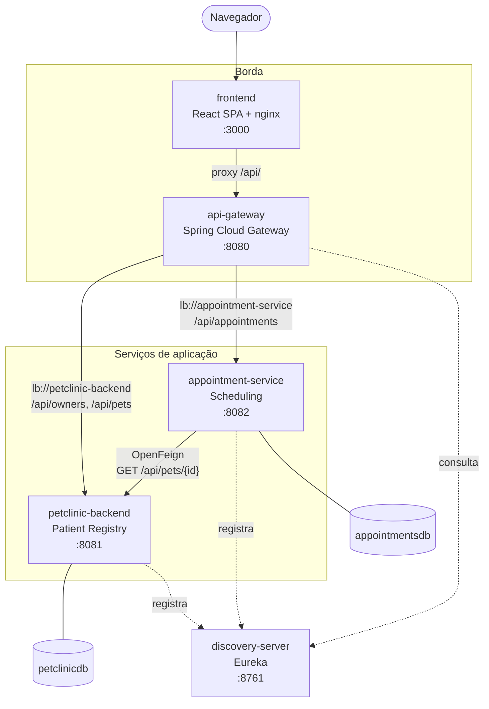
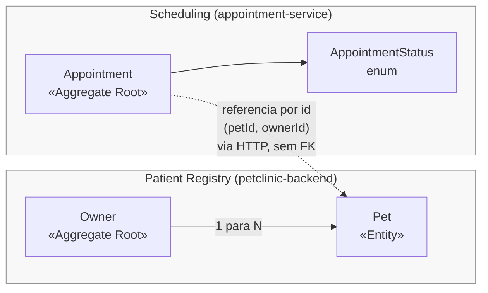
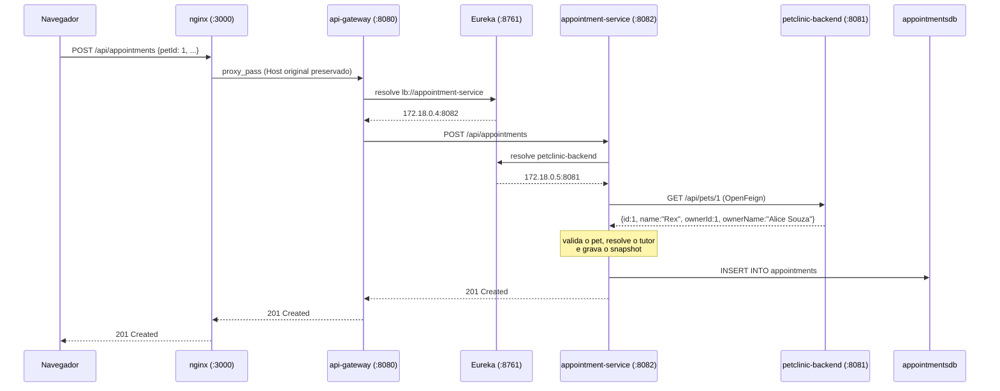

# Arquitetura do Microsserviço de Agendamento

Documento de referência do `appointment-service` e da infraestrutura distribuída
(Spring Cloud) introduzida para integrá-lo ao sistema existente.

---

## 1. Visão geral

O sistema deixou de ser um monólito com frontend acoplado e passou a ter **quatro
processos backend** coordenados por service discovery, com um ponto único de entrada:



| Serviço | Porta | Papel |
| --- | --- | --- |
| `discovery-server` | 8761 | Registro Eureka; resolve nomes lógicos em endereços |
| `api-gateway` | 8080 | Ponto único de entrada; roteia por caminho |
| `backend` (`petclinic-backend`) | 8081 | Monólito existente: tutores e pets |
| `appointment-service` | 8082 | **Novo microsserviço**: consultas |
| `db` | 5432 | PostgreSQL com duas databases independentes |
| `frontend` | 3000 | SPA React servida por nginx |

O monólito **saiu da porta 8080**, que passou ao gateway. Como o frontend sempre falou
com `/api` relativo, essa troca foi transparente para ele: só mudou o `proxy_pass` do
nginx.

---

## 2. O contexto delimitado Scheduling

O `appointment-service` implementa um bounded context novo, em relação
**Customer/Supplier** com o `Patient Registry` existente: Scheduling consome dados de
pets, e não o contrário. O monólito não sabe que o microsserviço existe.



### Agregado `Appointment`

| Campo | Tipo | Observação |
| --- | --- | --- |
| `id` | `Long` | identidade |
| `petId` | `Long` | referência externa ao Patient Registry |
| `ownerId` | `Long` | **não vem do cliente** — resolvido a partir do pet |
| `petName` | `String` | snapshot obtido via Feign no agendamento |
| `ownerName` | `String` | snapshot obtido via Feign no agendamento |
| `scheduledAt` | `LocalDateTime` | data/hora da consulta |
| `veterinarian` | `String` | profissional responsável |
| `reason` | `String` | motivo |
| `notes` | `String` | observações (até 1000 caracteres) |
| `status` | `AppointmentStatus` | `SCHEDULED` / `COMPLETED` / `CANCELLED` / `NO_SHOW` |
| `createdAt` / `updatedAt` | `Instant` | auditoria JPA |

---

## 3. Decisões de projeto

### 3.1 Database per service

Cada serviço tem sua própria database (`petclinicdb` e `appointmentsdb`), na mesma
instância PostgreSQL por economia de recursos. Nenhum serviço enxerga as tabelas do
outro — não há JOIN, não há chave estrangeira cruzando o limite.

A segunda database é criada por
[docker/postgres/init/01-create-appointments-db.sql](../docker/postgres/init/01-create-appointments-db.sql),
montado em `/docker-entrypoint-initdb.d`.

> **Atenção:** esse diretório só é executado quando o volume de dados está vazio. Em um
> ambiente que já tinha o volume `pgdata`, é preciso rodar `docker compose down -v` antes.

### 3.2 Referência por identificador, não por relação

`petId` e `ownerId` são colunas simples. Um `@ManyToOne` exigiria as duas entidades no
mesmo `EntityManager` e, portanto, no mesmo banco — o que anularia a separação. O preço é
que a integridade referencial deixa de ser garantida pelo banco e passa a ser
responsabilidade do serviço, o que é feito na validação via Feign.

### 3.3 Snapshot denormalizado de `petName` / `ownerName`

Ao agendar, o serviço grava o nome do pet e do tutor junto da consulta. Três motivos:

1. **Desempenho** — listar 50 consultas não dispara 50 chamadas HTTP ao monolito.
2. **Disponibilidade** — a listagem de consultas continua funcionando com o monólito fora
   do ar (verificado: `GET /api/appointments` responde 200 com o `backend` parado).
3. **Fidelidade histórica** — uma consulta antiga preserva o nome vigente na época.

O custo é a possibilidade de o snapshot ficar defasado. Isso é mitigado no `PUT`, que
reconsulta o monólito e atualiza o snapshot.

### 3.4 Tradução de erros da comunicação remota

O ponto mais sensível da integração é **não confundir "o pet não existe" com "não
consegui perguntar"**:

```java
try {
    return petClient.getPet(petId);
} catch (FeignException.NotFound ex) {
    throw new NoSuchElementException("Pet not found: " + petId);   // -> 404
} catch (FeignException ex) {
    throw new PetRegistryUnavailableException(...);                 // -> 503
}
```

Sem essa distinção, uma queda do monólito seria reportada ao usuário como "pet
inexistente", levando-o a recadastrar dados que já existem.

### 3.5 Sem circuit breaker

O escopo da etapa é comunicação distribuída, não resiliência. Os timeouts do Feign estão
curtos (3s de conexão, 5s de leitura) e a falha vira um 503 explícito e testado. Um
`spring-cloud-starter-circuitbreaker-resilience4j` seria a evolução natural, mas
acrescentaria uma camada sem cobrir nenhum requisito da etapa.

### 3.6 Módulos Maven independentes

Cada serviço é um projeto Maven autônomo, sem POM agregador — como o `backend/` já era.
Isso mantém cada `Dockerfile` com contexto de build igual ao seu próprio diretório, que é
o que permite `build: ./appointment-service` no compose funcionar sem truques.

---

## 4. Spring Cloud: como as peças se encaixam

### 4.1 Service discovery (Eureka)

Todos os serviços declaram `spring.application.name` e apontam para o Eureka:

```properties
eureka.client.service-url.defaultZone=${EUREKA_URL:http://localhost:8761/eureka}
eureka.instance.prefer-ip-address=true
eureka.client.enabled=${EUREKA_ENABLED:true}
```

`EUREKA_ENABLED=false` permite rodar um serviço isolado (é o que a suíte de testes usa,
via `maven-surefire-plugin`). `EUREKA_URL` é sobrescrito pelo compose para
`http://discovery-server:8761/eureka`.

Os intervalos padrão do Eureka são calibrados para produção e deixam um serviço
reiniciado invisível por até 30s. Para desenvolvimento e demonstração eles foram
encurtados (cache do servidor a 5s, renovação de lease a 10s, expiração a 30s,
`enable-self-preservation=false`), o que reduziu a convergência após um restart de
~30s para **8s** medidos.

### 4.2 Gateway

Rotas declaradas por propriedades, com alvos lógicos:

```properties
spring.cloud.gateway.server.webmvc.routes[0].uri=lb://petclinic-backend
spring.cloud.gateway.server.webmvc.routes[0].predicates[0]=Path=/api/owners/**,/api/pets/**
spring.cloud.gateway.server.webmvc.routes[1].uri=lb://appointment-service
spring.cloud.gateway.server.webmvc.routes[1].predicates[0]=Path=/api/appointments/**
```

O prefixo `spring.cloud.gateway.server.webmvc.*` é específico do Gateway 5.x — mudou em
relação ao `spring.cloud.gateway.*` das versões anteriores. Um erro aqui não impede o
gateway de subir, apenas o deixa sem rota nenhuma; por isso
`ApiGatewayApplicationTests` afirma explicitamente que as duas rotas foram carregadas.

Usamos a variante **servlet** (`gateway-server-webmvc`), coerente com o restante do
projeto, que é Spring MVC de ponta a ponta.

`GatewayExceptionHandler` traduz a falha do LoadBalancer ("nenhuma instância disponível")
em um **503 em texto puro**. Sem ele o Tomcat devolve uma página HTML de erro 500, que o
frontend exibe como falha genérica.

### 4.3 Cliente HTTP declarativo (OpenFeign + LoadBalancer)

```java
@FeignClient(name = "petclinic-backend", path = "/api/pets")
public interface PetClient {
    @GetMapping("/{id}")
    PetSummary getPet(@PathVariable("id") Long id);
}
```

`name` é o nome registrado no Eureka, não um host. Escalar ou mudar a porta do monólito
não exige alteração nenhuma neste código.

`PetSummary` usa `@JsonIgnoreProperties(ignoreUnknown = true)` e declara só os quatro
campos que interessam: o monólito pode acrescentar campos ao `PetResponse` sem quebrar
o microsserviço.

---

## 5. Endpoints da API REST

Base: `http://localhost:8080/api/appointments` (via gateway) ou `:8082` (direto).

| Método | Caminho | Corpo / parâmetros | Sucesso |
| --- | --- | --- | --- |
| `GET` | `/api/appointments` | `?petId=` \| `?ownerId=` \| `?status=` (opcionais) | 200 |
| `GET` | `/api/appointments/{id}` | — | 200 |
| `POST` | `/api/appointments` | `AppointmentRequest` | **201** |
| `PUT` | `/api/appointments/{id}` | `AppointmentRequest` | 200 |
| `PATCH` | `/api/appointments/{id}/status` | `{"status": "..."}` | 200 |
| `DELETE` | `/api/appointments/{id}` | — | **204** |

### Corpo de requisição

```json
{
  "petId": 1,
  "scheduledAt": "2026-12-01T10:00:00",
  "veterinarian": "Dra. Beatriz Nunes",
  "reason": "Check-up geral",
  "notes": "Trazer exames anteriores"
}
```

Validações: `petId` obrigatório; `scheduledAt` obrigatório e **no futuro** (`@Future`);
`veterinarian` obrigatório e não em branco; `notes` até 1000 caracteres.

### Corpo de resposta

```json
{
  "id": 4,
  "petId": 1,
  "petName": "Rex",
  "ownerId": 1,
  "ownerName": "Alice Souza",
  "scheduledAt": "2026-12-01T10:00:00",
  "veterinarian": "Dra. Beatriz Nunes",
  "reason": "Check-up geral",
  "notes": null,
  "status": "SCHEDULED",
  "createdAt": "2026-08-11T21:45:33.910465825Z",
  "updatedAt": "2026-08-11T21:45:33.910465825Z"
}
```

`petName`, `ownerId` e `ownerName` **não estavam na requisição** — são a evidência da
chamada ao Patient Registry.

### Códigos de erro

| Status | Quando | Corpo (texto puro) |
| --- | --- | --- |
| `400` | Validação do payload | JSON padrão do Spring Boot |
| `404` | Consulta inexistente | `Appointment not found: 42` |
| `404` | Pet inexistente no monólito | `Pet not found: 9999` |
| `409` | Veterinário já ocupado no horário | `O veterinário X já possui consulta agendada em ...` |
| `503` | Monólito indisponível | `Cadastro de pets indisponível no momento. Tente novamente.` |

O contrato de erro (texto puro para 404/409/503) é o mesmo do `GlobalExceptionHandler`
do monólito, para que o frontend trate os dois serviços de forma uniforme.

---

## 6. Fluxo completo de um agendamento



---

## 7. Componentes de front-end

| Arquivo | Responsabilidade |
| --- | --- |
| [frontend/src/services/appointmentService.js](../frontend/src/services/appointmentService.js) | Cliente HTTP do microsserviço; propaga a mensagem de erro do backend |
| [frontend/src/pages/AppointmentsPage.jsx](../frontend/src/pages/AppointmentsPage.jsx) | Página; combina dados dos **dois** serviços (consultas + lista de pets) |
| [frontend/src/components/AppointmentForm.jsx](../frontend/src/components/AppointmentForm.jsx) | Formulário; envia apenas `petId` |
| [frontend/src/components/AppointmentList.jsx](../frontend/src/components/AppointmentList.jsx) | Tabela com ações de editar, concluir, cancelar e excluir |

A página `Appointments` é onde a arquitetura fica visível ao usuário: o `<select>` de pets
vem do monólito e a lista de consultas vem do microsserviço, ambos sob a mesma origem
graças ao gateway.

Diferente dos serviços mais antigos do frontend, o `appointmentService.js` lê o corpo da
resposta de erro (`await res.text()`) e o propaga, para que mensagens como "veterinário já
ocupado" ou "cadastro de pets indisponível" cheguem à tela.

---

## 8. Cobertura de testes

| Módulo | Classe | Testes | Foco |
| --- | --- | --- | --- |
| appointment-service | `AppointmentRepositoryTest` | 6 | `@DataJpaTest`; derived queries e metadados de auditoria |
| appointment-service | `AppointmentServiceTest` | 9 | Regras de negócio com `PetClient` mockado: denormalização, 404 vs 503, conflito de agenda |
| appointment-service | `AppointmentControllerTest` | 11 | MockMvc; CRUD, filtros, 201/204/400/404/409/503 |
| appointment-service | `AppointmentServiceApplicationTests` | 1 | Context load |
| api-gateway | `ApiGatewayApplicationTests` | 1 | Context load **e** rotas efetivamente carregadas |
| discovery-server | `DiscoveryServerApplicationTests` | 1 | Context load |
| backend | `OwnerControllerTest` | 7 | CRUD do Owner e o 409 de e-mail duplicado (lacuna anterior) |
| backend | demais (pré-existentes) | 13 | Envers, repositórios, histórico |

**Total: 49 testes.** Toda a suíte roda sem rede: o `PetClient` é substituído por
`@MockitoBean` e o Eureka é desligado por `EUREKA_ENABLED=false` no surefire.
