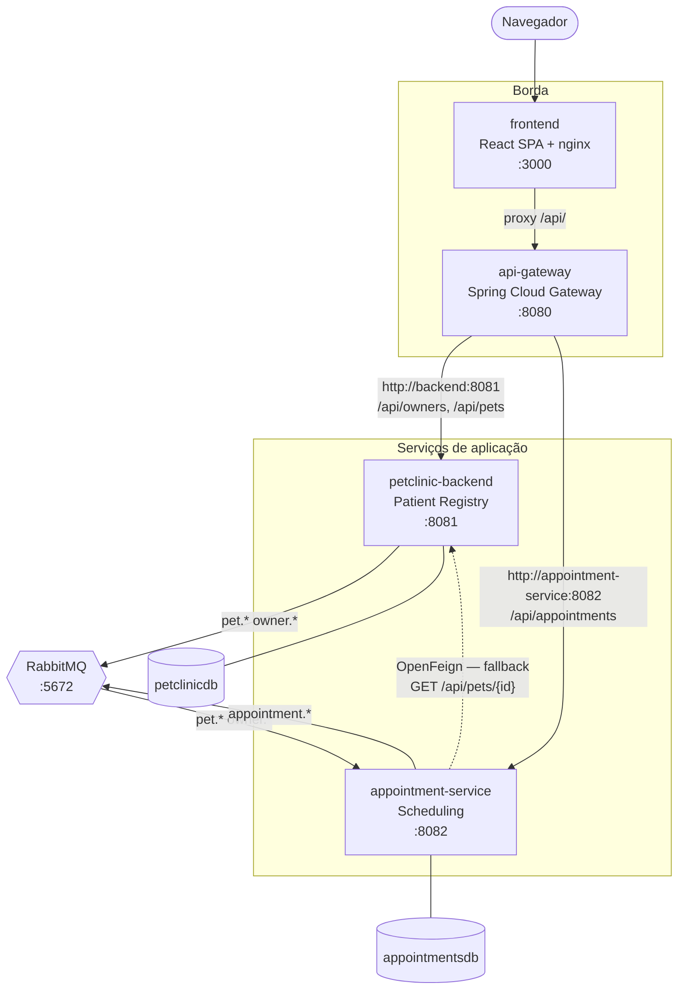

# Arquitetura do Microsserviço de Agendamento

Documento de referência do `appointment-service` e da infraestrutura distribuída
(Spring Cloud) introduzida para integrá-lo ao sistema existente.

> A comunicação entre serviços descrita aqui como síncrona (OpenFeign) foi depois
> substituída por eventos no RabbitMQ — o Feign permaneceu apenas como fallback.
> Ver [event-driven-architecture.md](event-driven-architecture.md).

---

## 1. Visão geral

O sistema deixou de ser um monólito com frontend acoplado e passou a ter **três
processos backend**, com um ponto único de entrada e um message broker mediando a
comunicação entre contextos. O service discovery é da plataforma: cada Service do
Kubernetes tem nome DNS e ClusterIP estável (ver `tp5.md` §5.6).

```mermaid
flowchart TB
    Browser(["Navegador"])

    subgraph Edge["Borda"]
        FE["frontend<br/>React SPA + nginx<br/>:3000"]
        GW["api-gateway<br/>Spring Cloud Gateway<br/>:8080"]
    end

    subgraph Services["Serviços de aplicação"]
        BE["petclinic-backend<br/>Patient Registry<br/>:8081"]
        AS["appointment-service<br/>Scheduling<br/>:8082"]
    end

    MQ{{"RabbitMQ<br/>:5672"}}

    DB1[("petclinicdb")]
    DB2[("appointmentsdb")]

    Browser --> FE
    FE -->|"proxy /api/"| GW
    GW -->|"http://backend:8081<br/>/api/owners, /api/pets"| BE
    GW -->|"http://appointment-service:8082<br/>/api/appointments"| AS

    BE -->|"pet.* owner.*"| MQ
    MQ -->|"pet.* owner.*"| AS
    AS -->|"appointment.*"| MQ
    AS -.->|"OpenFeign — fallback<br/>GET /api/pets/{id}"| BE

    BE --- DB1
    AS --- DB2
```

A seta tracejada é o que restou da comunicação síncrona: o Feign só entra quando a
projeção local do `appointment-service` ainda não conhece um pet.

| Serviço | Porta | Papel |
| --- | --- | --- |
| `api-gateway` | 8080 | Ponto único de entrada; roteia por caminho |
| `backend` (`petclinic-backend`) | 8081 | Monólito existente: tutores e pets |
| `appointment-service` | 8082 | Microsserviço de consultas; consumidor e produtor de eventos |
| `rabbitmq` | 5672 / 15672 | Message broker; UI de gerenciamento na 15672 |
| `db` | 5432 | PostgreSQL com duas databases independentes |
| `frontend` | 3000 | SPA React servida por nginx |

---